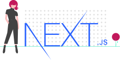

<div align="center">
  

  <h1>NextJS Template</h1>
  <p>A complete project structure to create React web applications using NextJS and Typescript</p>
</div>

<div align="center">


[](http://commitizen.github.io/cz-cli/)


</div>

<hr>

## Introduction

This project was **heavily inspired by [@willianjusten](https://github.com/willianjusten) and his online course [React Avançado](https://www.udemy.com/course/react-avancado/)**. But it also brings a lot of improvements as a result of my own research and evolution throughout the years.

<hr>

## Getting started

Simply click on `Use this template` button up there and happy coding!

Or you can run:

```bash
  yarn create next-app --example https://github.com/evfjunior/nextjs-template
```

<hr>

## Techs and Tools

- [ReactJS](https://reactjs.org)
- [NextJS](https://nextjs.org/)
- [TypeScript](https://www.typescriptlang.org/)
- [Yarn](https://yarnpkg.com/)
- [Styled Components](https://styled-components.com/)
- [Styled Media Query](https://github.com/morajabi/styled-media-query)
- [Jest](https://jestjs.io/)
- [React Testing Library](https://testing-library.com/docs/react-testing-library/intro)
- [Storybook](https://storybook.js.org/)
- [ESLint](https://eslint.org/)
- [Prettier](https://prettier.io/)
- [Husky](https://github.com/typicode/husky)
- [Lint Staged](github.com/okonet/lint-staged)
- [Commitizen](https://commitizen-tools.github.io/commitizen/)
- [Commitlint](https://commitlint.js.org/)
- [Plop](https://plopjs.com)

<hr>

## Commands

- `dev`: runs the development server on `localhost:3000`
- `build`: creates the production build
- `start`: starts a demo build
- `commit`: commit changes using commitizen-cli
- `generate`: runs Plop to generate files
- `lint`: runs the code linter
- `storybook`: runs Storybook on `localhost:6006`
- `storybook:build`: creates the Storybook build
- `test`: runs Jest
- `test:watch`: runs Jest in watch mode

<hr>

<div align="center">

Made with ❤️ by [evfjunior](https://github.com/evfjunior)

</div>
